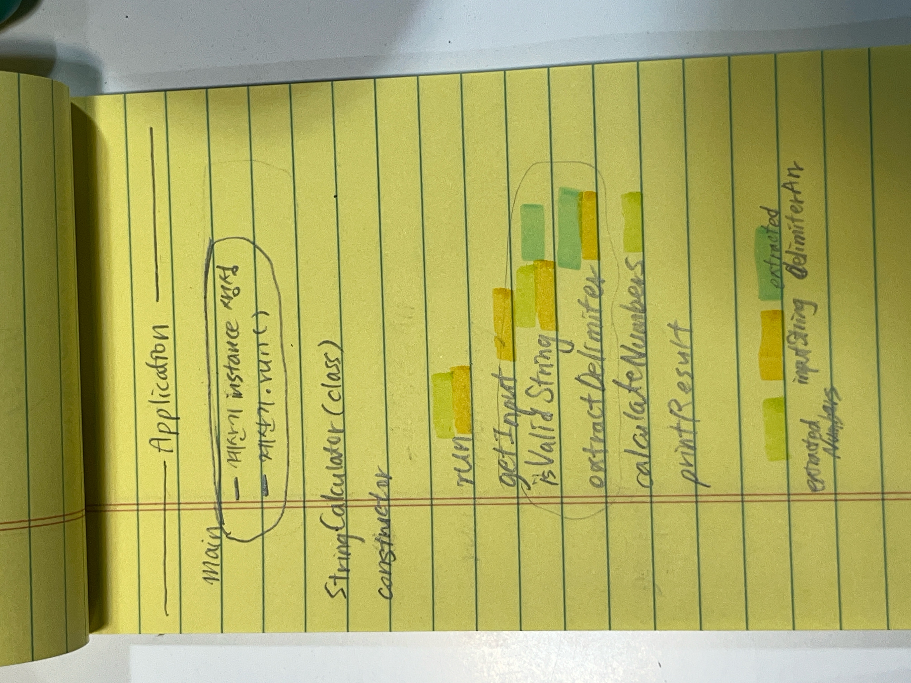

# 1주차 리팩토링 정리

미션을 수행하면서 고민하던 것들을 까먹을 것 같아서 모두 적어놓았다. 하나씩 살펴보면서 코드를 개선해보는 과정을 담고자 한다.

## 구현하면서 마주한 문제점

놀랍도록 많다.

물론, 이따가 다시 고민해도 된다고 생각한 문제가 당장 해결해야되는 문제였는지도 몰랐을 수 있다. 그치만 그 기회를 통해서 또 배우면 된다..(애써 의연)

 

## 문제 1. 물고 물리는 함수

처음 작성했던 코드의 로직은

마치 동기적인 함수를 연속으로 구현할 때처럼 연결되듯 작성했다. 코드의 흐름을 느끼기 좋기 때문이었는데, 큰 문제점이 있었다.

> 이런 코드는 테스트 코드를 작성하는게 거의 의미가 없고 불가능하기까지 하다......

### 배움 1. 하나의 함수 안에서 한 가지 기능을 시작하고 끝마칠 수 있어야 한다.

테스트 코드를 작성하면서 **함수 기능 분리의 중요성**을 깨달았다. 한 가지 동작을 테스트하기 위해서 수정한 코드의 특징은 다음과 같았다.

- 전역변수는 특별한 변경/광범위한 조회가 없다면 매개변수로 받아 처리
- 하나의 함수 안에서는 하나의 기능이 끝나야 한다.
  - A 함수가 끝나고 B 함수를 호출해도 되는 상황이라면 반드시 끝내고 호출
  - 단위 테스트 가능해짐

프리코스 디스코드에서 TDD에 대한 토론이 진행된 것을 읽어보았는데, 테스트 코드를 먼저 작성하고 그에 따라 돌아가는 코드를 작성하려고 하면서 **"테스트 하기 쉬운 코드를 작성 -> input과 output이 뚜렷해진다"** 라는 글을 보았다.

나 또한 테스트 가능한 코드를 작성하려고 노력하는 과정을 겪었다보니 완전히 공감할 수 있었다.

 

## 문제 2. 네이밍

1번 문제를 해결하면서 로직은 다음과 같이 바뀌었다.

init() 메서드가 많은 역할을 맡게 되었다.
그렇다면 더 이상 시작의 의미를 가진 init이라고 이름지을 필요가 없다고 생각했다.

### 배움 2 : 역할이 보이는 이름으로 작명하기

역할이 명확해질 수 있도록 `run()` 으로 이름을 변경했다.

 

## 문제 3. 변수 사용범위를 고려하고 선언했나

변수 사용 범위를 다시 고려하며 `inputString` 을 **지역 변수**로 선언했다.

- `inputString` 초반에 입력받은 inputString 자체를 여러 함수에서 조회하거나 변경하는 경우가 적으므로 변경
- `delimiterArr` 기본 구분자를 넣기 위한 초기화가 무조건 필요하므로 전역변수 유지

### 배움 3 : 함수의 기능은 변수의 범위를 결정해

- `extractedNumArr`는 isValidString()에서 문자열 검사와 함께 조작되지만, 해당 메서드가 반환하지는 않으므로 전역 변수로 선언하였다.

 

## 문제 4. Commit message가 더 깔끔했으면 해

커밋 메시지에서 tag의 길이가 들쭉날쭉해 복잡해보인다.

Angular JS에서 사용하는 방법을 최대한 비슷하게 차용해보려고 관련 코드의 위치를 적는 \<scope> 를 이용했더니 \<tag> 뒤에 글이 길게 늘어져서 description의 가독성이 안 좋아진다.

### 배움 4 : java에서 관련 함수명은 description에 적자

java 코드 특성상 class과 method 명이 길기 때문에 이 방식은 다음 미션부터는 지양해야겠다고 생각했다. 변경 함수에 대한 정보는 description에도 적기 때문에 굳이 앞쪽에 반복해주지 않아도 될 것 같다.

 

## 문제 5. 동적 배열을 이용한 이유

배열을 동적 배열로 설정한 이유를 적어보려 한다.

미션 설명에서 특별히 적혀 있지 않은 것은 내가 임의로 정하면 된다고 했다.
나는 다음과 같은 상황을 고려했다.

- 구분자 `delimiterArr`
  - 구분자가 문자(`char`타입)/문자열(`string`)인 경우
  - 구분자에 알파벳이 포함된 경우
  - 구분자가 하나인 경우 / 여러 개인 경우
    - 구분자 여러개를 설정하면서 명시하는 형식 간에 숫자가 껴있는 경우
- 숫자 `ExtractedNumbers`
  - 숫자가 없는/있는 경우
  - 숫자가 많은 경우

다음과 같은 경우와 주어진 입력값의 크기가 정해지지 않은 상황에선 크기가 자유로운 동적 배열을 이용하는 것이 가장 적합하겠다고 생각했다.

### 배움 5 : 시간 복잡도를 챙겨야 하는 상황에선 적당히 큰 크기의 원시배열을 이용해보자

하지만 함수의 호출을 많이해야 하는 상황이 온다면, 넓은 크기의 배열을 다시 할당해서 복사하는 형태로 작동하는 동적배열을 이용하는 것이 효율적이지 못하다는 생각은 든다. 시간 복잡도가 중요한 상황에선 적당한 크기의 배열을 선언하고 시작하는 것이 바람직할 것 같다.

 

## 문제 6. 어설픈 BFS -> 입력 순서가 보장이 안되고 있다

기능하도록 박박 우겨서 작성한 코드이다보니, 입력 순서가 보장이 안된다.
3+5+7을 원했지만 7+3+5 로 작동한다는 문제가 있다. 물론 결과에는 지장이 없지만, 이왕이면 순서를 보장해주는 코드로 수정하고 싶다.

현재의 문제는 숫자만 남는다면 바로 `extractedNumbers` 배열에 넣는다는 것이다. 그렇다보니 처리가 먼저 된 숫자부터 쌓이게 된다.

- 계속 deque에 계속 넣는 방식으로 한다면 시간은 오래 걸리겠지만 순서는 보장이 됨 -> 그러나 예외처리가 어려워진다.

### 배움 6 : 한 번의 for문에 여러 목적을 달성하려 하지 말자

deque에 계속 넣는 방식으로 문제를 해결해보았다.

순서는 보장되는 결과를 만들 순 있었지만 **구분자가 두개 연속으로 쓰이는 경우** 엔 빈 값이 deque에 저장되므로 마지막에 모두 숫자(와 빈칸)만 남았어도 한 번 더 탐색을 돌려야 번거로움이 있었다. 구분자 리스트에 있는 구분자를 다 돌았는지에 따라 while문이 돌아가므로 index가 구분자 수보다 한 번 더 돌려야 했다. 처음 보는 사람은 절대 이해할 수 없는 로직이 될 것이다.

### 배움 7 : 함수의 이름을 가장 어울리게 '다시' 지어주는 결심이 필요해

위 로직처럼 구현을 하고나니 extractNumbers메서드가 숫자를 추출하면서 혼자 예외처리까지 해주는 방식이 되었다. isValidString은 유명무실이 되었다. 그래도 검증은 isValidString이 따로 해주었으면 해서, extractNumbers를 변경했다.

- `extractNumbers` return type을 deque로 변경하면서 이름도 `splitNumbers` 로 변경했다.
- `isValidString` 은 deque를 받아 빈 요소를 체크하고, 숫자만 있을 경우 숫자 배열에 추가하는 방식인 숫자 검증기능을 하도록 분리하였다.

### 배움 8 : ArrayList와 ArrayDeque는 assertThat 방식이 다르다

ArrayList\<Integer>를 반환하던 방식에서 ArrayDeque\<String>을 반환하는 방식으로 함수의 반환 타입과 기능을 바꾸었더니, 테스트 코드를 다시 작성하였다.

ArrayList로 비교할 때는 isEqualTo()로 비교했지만, ArrayDeque 간에 비교할 때는 isEqualTo()가 인스턴스의 주소값을 비교하는 방식으로 작동한다.

내용과 순서를 모두 비교할 수 있는 `containsExactlyElementsOf()` 를 사용해 고쳐주었다.

이것에 대해서는 한 번 더 블로그에 정리해야겠다.

 

## 문제 7. 테스트로 구석구석 양치시키기

테스트 케이스를 구석구석 다양하게 만들어보고 싶다.
해당 문제는 복잡하기 보다는 입출력이 단순한 문제라서, 테스트 케이스를 꼼꼼하게 작성하는 연습을 하기 좋을 것 같다.
이것은 아예 다른 md로 따로 정리할 것이다.

 

## 리팩토링 전체 소감

기능 구현보다 리팩토링이 더 오래 걸렸던 것 같다. 간단한 문제라고 생각했는데 구현하다보니 생각할 것이 계속 생기는 문제였다. 사실 하나하나 마음에 걸리는 것들을 정리해놓고 본격적으로 타파해 본 경험은 처음이라 굉장히 뿌듯하다.

여전히 이 코드가 좋은 코드라고 생각하지는 않지만, 이 글의 처음 부분을 작성할 때 내가 생각했던 문제 없는 코드(문제 적은 코드..라고 하겠다)에 훨씬 가까워지지 않았나 싶다.

코드에 관한 것들뿐만 아니라 커밋 메시지 같은 앞으로의 기록 방식에도 영향을 줄 수 있는 고민을 하게 되어 뿌듯했다.
