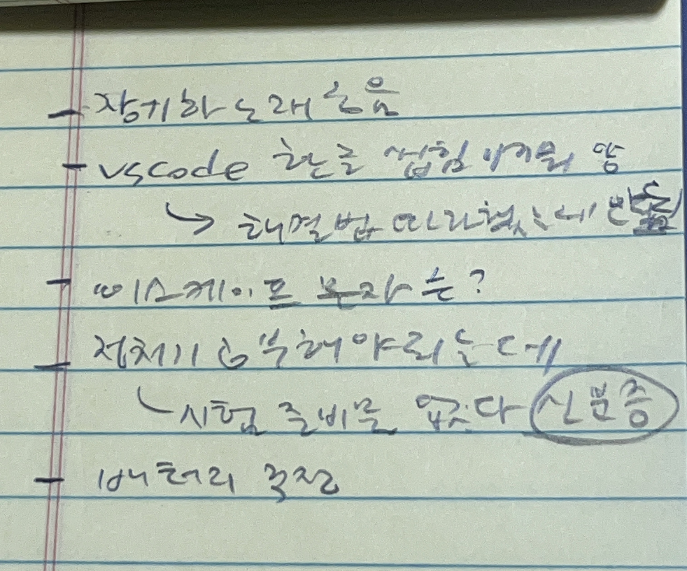

# 우테코 프리코스 1주차 회고

## 미션 : 문자열 덧셈 계산기

1주차가 벌써 마무리되고 있습니다.
구현을 시작할 때는 분명 쉬울거라고 생각했는데, 이것저것 생각하다보니 예상보다 시간이 오래 걸렸습니다. 구현과 리팩토링, 기록의 과정까지 회고를 진행해보려 해요.

1주차 회고의 꼭지는 다음과 같이 정리해보았습니다.

1. 잡생각이 떠올라 방해된다면 어디에 적어두고 잠깐 까먹자
2. 하나의 기능에 가장 작은 책임을 부여하자
   - 2-1. 기능 명세를 정확히 하는 이유는 나를 위해서야
   - 2-2. 한 로직에 많은 것을 해결하려 하지 말자
3. 테스트를 먼저 생각 -> 명확한 책임을 가진 코드가 된다
4. 소감

---

## 1. 잡생각이 떠올라 방해된다면 어디에 적어두고 잠깐 까먹자

코딩을 시작하면 초반에는 집중을 꽤 하지만 시간이 지날수록 눈이 피로해지고 집중력이 떨어지곤 합니다. 그러다보면, 시간은 흐르고 있는데 뇌가 멈춘 상태로 화면을 들여다보고 있는 저를 발견할 수 있었어요.

그때부터는 뇌가 멈추는 것뿐만 아니라 여러 잡생각이 들기 시작합니다.

손가락은 바쁘게 타이핑을 하고 있지만 "지금 듣고 있는 이 노래 좋다 무슨 노래지, 아 이사람 노래 좋던데 다른거 없나", "아 이 ide 기능 중엔 어떤게 안좋네 이거 해결방법 없나", "저녁을 집에서 먹을까", "이렇게 로직을 적으면 이런 예외도 발생하겠는데" 등의 생각이 10초 안에 동시에 들 정도로 코드에 집중을 못하는 모습이 되곤 합니다.

그래서 이걸 잠깐 어디 적어두었습니다. '이런걸 적어놓는다고?'싶더라도 그냥 적어두는 겁니다.

**단어라도 적어두면 그때부턴 그 잡생각이 더이상 안나고 할 것에 집중할 수 있는 효과가 있었습니다.** 중요한 일을 적어둔다는 것은 너무 당연한 상식이지만, 쓸데 없이 현재에 집중하는 것을 방해하는 생각들에게도 적용되는 방법이었다는 걸 깨닫게 되었습니다.

앞으로 이런 방법을 전략적으로 이용해야겠다고 생각할 수 있는 시간이었습니다.

 

## 2. 하나의 기능에 가장 작은 책임을 부여하자

### 2-1. 기능 명세를 정확히 하는 이유는 나를 위해서야

기능에 대한 명세 후에 시작하라는 미션 요구사항을 보고 난 후, 목적을 이루기 위한 동작을 나누어 기능으로 정의하는 연습을 할 수 있었습니다. 이론적으로 기능을 명세하는 것은 중요하다고 익히 배워왔지만, 그것은 **협업을 위해서** 라고 생각했었어요.

이번 미션을 통해서 **기능 명세는 혼자 개발하는 상황에 놓인 "나를 위해서도" 필요하다**는 것을 깨달았습니다. 기능을 먼저 정리해놓고 개발을 진행하면 다음과 같은 장점이 있었습니다.

#### 기능 명세의 장점

1. 표로 정리하면 파악하기에도 좋고, 커밋 메시지를 작성하기에도 좋다.
2. 기능 이름을 짓기 위해 해당 기능이 가진 가장 핵심 역할을 생각하게 된다.
3. **_그 이름에 벗어나면 따로 분리하여 점점 최소의 기능을 가진 블록 단위로 코드를 작성할 수 있게 된다._**

3번이 제일 감명 깊은 이점이었습니다.

> (기존) 코드를 짓고 이름을 붙인다

가 아니라

> (배움 후) **_이름을 붙이고 그에 맞는 코드를 만든다_**

라는 개념이 새롭기도 하면서 오히려 더 명확하게 다가왔어요. 기능의 이름을 정해놓고 시작하면 코드를 작성하는 의도와 목적이 뚜렷해지는 것과 더불에 이름에서 벗어나는 역할을 골라낼 수 있게 됩니다. 더 좋은 코드를 작성할 수 있도록 도와주었다고 생각합니다.

미션 요구사항에서 왜 기능명세를 하고 구현하라고 했는지 확실하게 깨달을 수 있었습니다. 너무 좋아요

 

### 2-2. 한 로직에 많은 것을 해결하려 하지 말자

반복문을 돌리는 김에

1. 구분자에 따라 문자열을 split해서 배열에 담기
2. 요소가 숫자로만 이루어졌을 경우 배열에 추가하기
   를 같이 하도록 초반에 코드를 작성했습니다.

어차피 같은 배열을 도는데 반복문을 다른 함수에 따로 두면 시간이 더 오래걸릴거라는 생각에서 비롯된 것이었습니다.

이렇게 구현을 하고 난 후에 테스트 코드를 작성하다보니 많은 로직을 집어넣으면 무엇보다 "테스트하기가 어렵다"는 것을 배웠습니다. 복잡한 로직이 될수록 에러가 발생할 수 있는 구간은 많아지고 그것이 엉겨붙어있으니 떼어내 원인을 찾기가 어려워지더라구요.

결국 다 떼어놓고보면 단순한 문제인 경우가 많습니다. 큰 반복문 덩어리를 통째로 보려고 하니까 문제가 되는구나를 깨닫고 구분자가 아닌 문자열이 남아있는지를 확인하고 숫자 배열을 만드는 2번 과정은 isValidString 함수로 분리하였습니다.

사실 시간복잡도면에서도 O(n)짜리 for문 하나를 다른 함수에서 한번 더 돈다고 해서 기존의 O(n^2) 이상으로 늘어나지는 않기 때문에 크게 차이는
나지 않는다는 것을 알게 되었습니다. 역시 시간복잡도 고려보다는 일단 기능부터 분리하는 것이 최고인 것 같습니다.

 

## 3. 테스트를 먼저 생각 -> 명확한 책임을 가진 코드가 된다

[리팩토링 정리](https://github.com/dhrgodms/woowa-pre-records/blob/main/Week1/1%EC%A3%BC%EC%B0%A8_%EB%A6%AC%ED%8C%A9%ED%86%A0%EB%A7%81_%EC%A0%95%EB%A6%AC.md)에서도 적었듯, TDD의 필요성과 어려움에 대한 우테코 프리코스 디스코드 토론을 읽다가 공감될 만한 글을 보았어요.

> **테스트 코드를 먼저 작성**하고 개발에 임하게 되면, **테스트하기 쉬운 코드**를 작성하게 되고 그러면서 더욱 **입출력이 명확한 코드**, 깔끔한 코드를 작성하게 된다.

는 의견이 있었는데요. 이번 미션을 통해서 그 이야기에 공감할 수 있게 되었습니다. (감개무량+뿌듯+감사)

저는 이번 미션에서

> 기능 명세 -> 구현 -> 테스트 코드 -> 리팩토링

순으로 개발을 진행했습니다. 기능을 다 구현하고나서 테스트 코드를 작성할 때 이 순서가 잘못되었다는 것을 깨달았습니다.

테스트 코드를 작성하면서 다시 메인 코드를 그에 맞게 고치게 되고 그러다보면 결론적으로는 테스트 코드를 통과하기 위한 코드, 테스트를 잘 통과하는 코드가 되어있습니다. 테스트 코드를 먼저 작성했다면 테스트가 고려되지 않은 코드의 입출력을 고치느라 두 번 일하지 않아도 될텐데 말이에요.

다음 번에는

> 기능 명세 -> 함수 이름 짓기 -> 테스트 코드 작성 -> 구현 -> 리팩토링

순으로 진행해야겠습니다.

코드를 타이핑하기 전에 머릿 속으로 고민을 오래 하고 잘 정리해놓는 과정이 필요하다는 것을 알게 되었으니, 다음 미션은 좀 더 체계적으로 해결할 수 있을거라는 기대를 하게 됩니다.

## 4. 1주차 미션 소감

지원한 모든 사람이 프리코스를 진행할 수 있는 부분이 참 감사한 기회인 것 같습니다. 정리하는 습관을 들이고, 조금 더 나에게 맞는 정리 방식을 찾아 시간을 과하게 들이지 않으면서 기록하는 것을 연습하고 싶었는데 벌써부터 얻은 것이 많습니다.

1. 한 md파일에 너무 많은 내용을 담지 말자.
2. 이왕이면 그림이나 표로 정리하자.
3. IDEA로 md 파일 작성하는거 생각보다 되게 괜찮다

벌써 세 가지나 배웠습니다. 1주차 미션이 저에게 준 핵심적인 가르침은 **_"Unit(단위)에 집중하라"_** 인 것 같습니다. 무엇이든 한 번에 너무 많은 것을 하고, 많은 것을 담으려 해왔던 것 같습니다.

덜어내고, 분리하고, 짧게라도 기록하는 과정을 통해 지식과 성장 과정 뿐만 아니라 저의 모습까지도 모든 것에 투영해 깔끔하게 남겨보아야겠다고 생각하게 되었습니다.

이번 미션도 감사했습니다~!(방긋~)
