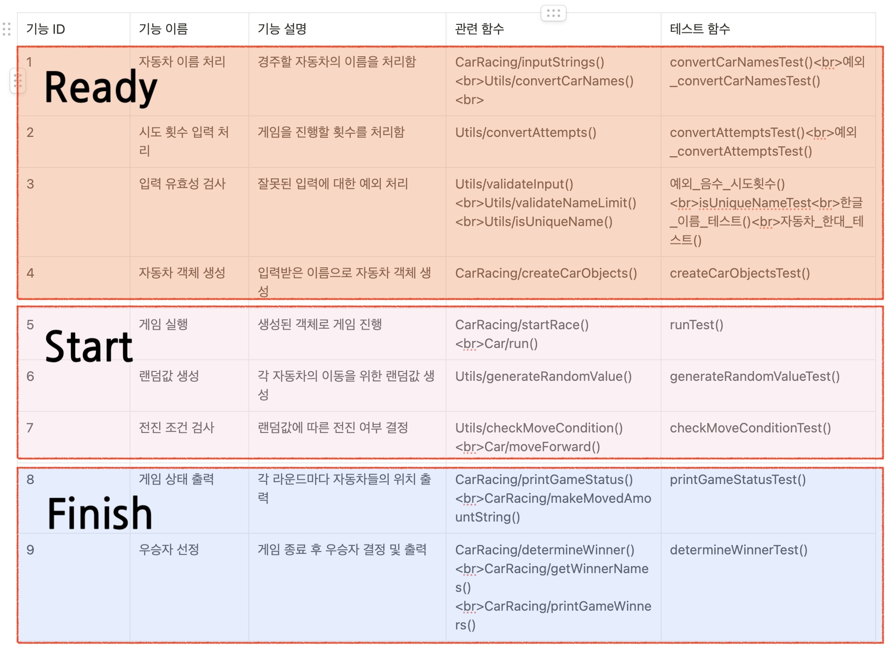
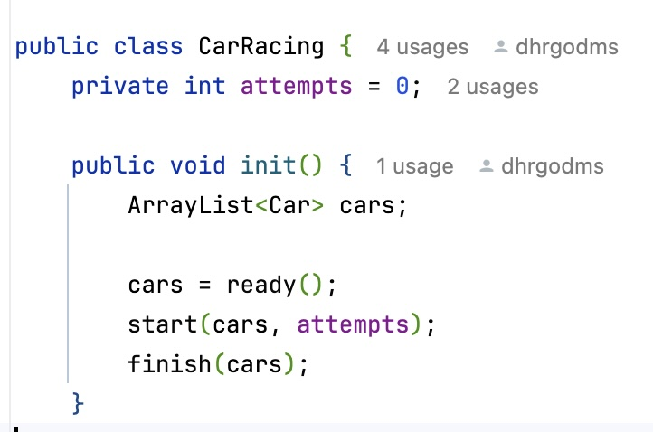

# 2주차 리팩토링 정리

## 구현하면서 마주한 문제점

> 1. 요구사항을 잘 따랐는지 확인하기
> 2. 메서드를 잘 구분했는지 한번 더 검토해보기
>    - Utils에 애매한건 다 갖다 넣은 느낌이라서 정리가 필요하다.
>    - 검증/변환/나머지 이런 식으로.
> 3. 접근제어자 적절하게 사용하기(name을 private으로 선언하고, getter/setter 활용하기)
> 4. 제약 사항 정확히 정리하기
> 5. 1주차 피드백 잘 반영했는지 확인하기

<br>
<br>

## 문제 1. 요구사항을 잘 따랐는지 확인하기

문제의 요구사항은 크게 3가지로 나눌 수 있다.

1. 과제 진행 요구 사항
2. 기능 요구 사항
3. 프로그래밍 요구 사항

### 과제 진행 요구 사항


### 기능 요구 사항


### 프로그래밍 요구 사항

 

전체적으로 다 지켰다고 생각했지만 한 가지, 1주차 때부터 고민했던 것이 있다.

프로그래밍 요구사항에서 _**프로그래밍 요구 사항에서 달리 명시하지 않는 한 파일, 패키지 등의 이름을 바꾸거나 이동하지 않는다.**_ 를 보고 클래스도 생성하면 안되나?라고 생각해서 혼란스러웠다..

구현하다보니 Application.java 파일이 점점 길어지고 가독성이 안좋아져서 분리했다. 생성에 대한 요구사항은 없었으니까 괜찮을 것이라 생각한다.

분리하게 되면서 메서드들이 어디에 포함되어야 하는지에 대해 더욱 고민하게 되었다.

이렇게 되면서 자연스럽게 2번 문제에 대해 고민하게 되었다. RacingCar에 최소로 넣자고 생각하다보면 변환하거나 검증하는 것도 Utils에 넣을 수 있지 않을까라고 생각했던 것이다.

<br>

---

## 문제 2. 메서드를 잘 구분했는지 한번 더 검토해보기

정확한 나만의 기준이 없는 것이 가장 큰 문제라고 생각했다. **나만의 기준을 세우고 다시 분류해보자.**

어떤 것들을 클래스로 추출하여 캡슐화하는 것이 좋을까?

1. 중복되는 매개변수나 함수
2. 도메인과 관련된 규칙과 독립적인 것
3. 클래스가 가져야하는 최소 책임과 거리가 있는 것

이라고 정해보았다.

## 배움 1. 클래스 책임 확실히 짚어보기

- Car (자동차 객체)
  - 이름, 전진한 값을 포함해야 한다.
  - 직접 전진하는 객체이므로 전진하는 메서드를 포함해야 한다.
- CarRacing (경주 게임 객체)

  - 게임 준비
    - 입력 받기 / 자료형 변환 / 유효성 검증
  - 게임 실행 (핵심적인 책임)
    - 랜덤값 생성 / 전진 / 반복
  - 게임 종료
    - 우승자 선정 / 발표

  를 담당한다.

이렇게 정리하고보니 경주 게임 객체도 **_준비(Ready)-실행(Start)-종료(Finish)_** 로 나눠볼 수 있겠다.


클래스와 method를 다음과 같이 나누었다.



나눈 후에 CarRacing 코드를 각 클래스에 맞게 수정하여 Utils의 불분명한 책임도 해결되고, CarRacing 코드의 가독성도 한결 나아졌다.



## 배움 2. 객체를 현실에 대입해 생각해보자

경주 게임을 어떻게 구현하지?라고 생각하고 달려들면 오히려 클래스 각자가 가지는 최소의 책임을 생각하기 어렵다는 것을 깨달았다.

진짜 경주게임이 진행된다고 할 때, 우리가 기대하는 "경주 게임" 이라는 것이 무엇인지 생각해보았다. 우리는 경주 게임을 티비에서 보면 선수를 등록하는 것은 나오지 않는다. 주로 경기 장면이 나오고, 기록이 나온다. 우승자 시상식도 중요하지만, 그보단 경기 종료마다 시간 기록을 먼저 보여주는 것이 더 메인이라고 할 수 있다.

청중의 입장에서 선수 등록은 대충 어찌저찌 선수 등록했겠지~, 게임 룰은 잘 정해져있겠지, 시상은 게임 기록에 따라 정해지겠지~라고 막연하게 생각하고, 게임의 진행과 결과에 중점을 둔다고 생각하고 나누니 CarRacing 객체가 무엇을 담으면 좋을지 한결 편하게 정할 수 있었다.

<br>

---

## 문제 3. 접근제어자 적절하게 사용하기

1주차 미션과 다르게 접근 제어자를 신경쓰며 코드를 작성하려고 노력했다. 클래스 내에서만 사용되는 것은 private, 바깥에서 호출되더라도 인스턴스가 생성되어야 호출할 수 있는 protected 등 최대한 활용해서 작성해보았다.

접근 제어자를 찾아보다 값을 직접적으로 조회하거나, 조작하는 것을 피하기 위해 .name으로 이름을 조회하지 않고 getName이라는 getter/setter 메서드를 이용한다는 것을 알게 되었다.

## 배움 3. 외부에서 클래스 내 멤버에 직접 접근하게 두지 말자.

기존에 public이었던 name 멤버를 private으로 보호하고, getName 함수를 만들어 접근할 수 있도록 Car 클래스에 반영해보았다.

<br>

---

## 문제 4. 제약 사항 정확히 정리하기

2주차 문제는 입력에서 생각할 거리가 많았다. 이름 입력이 쉼표만으로 구별될 수 있는 만큼, 이름에 어떤 문자까지 허용할 것인지를 정해야 했다.

내가 정한 입출력 제한은 다음과 같다.

    - 자동차가 1대 참가해도 게임은 진행된다(기록측정용으로 혼자 레이싱하기도 함)
    - 이름은 영문/숫자/한글 외에 다른 문자는 올 수 없다.(공백 포함)
    - 쉼표(,)를 구분자로 하며, 그외의 특수문자는 모두 예외를 throw한다.
    - 시도횟수는 1 이상이어야 한다.

## 배움 4. 흔한 습관으로 인한 에러가 많이 발생한다면 줄일 수 있는 방안을 찾자.

이름을 입력할 떄, 쉼표 뒤에 공백을 넣는 경우가 많아서, 그것만 허용하도록 정규식에 추가해 리팩토링하였다.

<br>

---

## 문제 5. 1주차 피드백 잘 반영했는지 확인하기


- IDEA의 디버거를 많이 써보지 않아서 출력함수를 사용해 디버깅을 했었는데, 디버거를 써보는 경험을 하게 되어 아주 도움이 되었다. 자바 특성상 객체 지향 성격 때문에 리터럴을 보려면 watch를 사용해야 하는 경우가 많아 익숙해져야할 것 같다.
- 코드컨벤션 중에도 공백까진 상세하게 찾아보진 않았었는데 이 기회에 알게 되어 좋은 경험이 되었다고 생각한다. 코드 포매팅을 사용하는 것이 아주 도움되었다.
- 최대한 주석을 줄이고 코드 자체가 잘 읽힐 수 있도록 이름을 잘 지어보려 했다.

## 배움 5. 인터페이스를 참조타입으로 이용하자

```java
List<String> stringList = new ArrayList<>();
ArrayList<String> stringArrList = new ArrayList<>();
```

가 어떤 차이점이 있는지 궁금했고, 사실 이유를 잘 몰라서 아래처럼 계속 사용해왔었다. java 알고리즘 인터뷰 책에서 동적 배열을 윗줄 코드처럼 선언하기에 검색해보았다.

### 어떤 차이가 있나?

> - 참조타입을 인터페이스(List\<T>)로 선언할 경우
>   => 같은 인터페이스 내 다른 구현체로 코드를 변경하기 쉽기 때문에 유용하다.
>
> - 구현체로(ArrayList\<T>)로 선언할 경우
>   => 사용할 수 있는 메서드가 구현체로 한정되기 때문에 추후에 확장 시 변경이 어려울 수 있다.

확장성을 고려하는 연습을 하기 위해 ArrayList를 참조타입으로 선언했던 코드들을 인터페이스를 참조타입으로 선언하도록 수정하였다.

<br>
<br>

## 참조

https://ruriro.tistory.com/43
